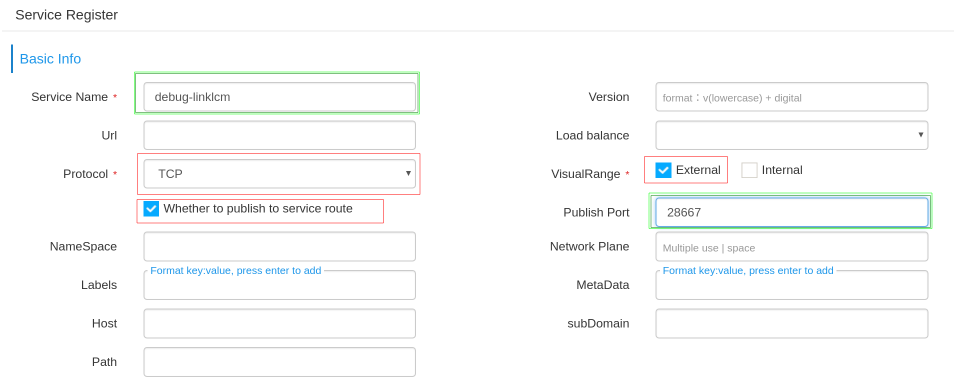
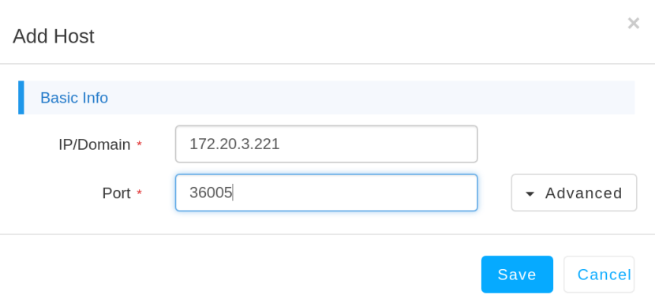

#### 登录环境
- ssh ubuntu@10.86.110.251 密码：cloud
- $su   进入root模式
- $pdm-cli node list 查看当前节点信息
- $docker ps -a 查看各容器运行情况
  
#### 打开容器的调试端口
- $docker exec -it   容器id /bin/
- 找到run.sh，并修改，把调试端口打开
- 重启容器: docker restart  容器id
- 等待，等到msb上该服务正常（否则该服务的rest info，metrics info会报错，比如502）,查看方式：
    - 登录[https://10.86.110.251/msb]， 在Service Route ->Namespace list里选当前使用的，比如umebn，然后选View Services
- 搜索服务，比如linklcm，点击右侧的view按钮，然后可以看到rest info，metrics info的tab页

#### 将调试端口发布到服务路由
- 同上，找到相应的服务，可以看到最下面的Nodes List信息，记住其中的ip, 如下:
   
- 登录https://10.86.110.251/msb  ->Service Register,如下填写
   - 其中Service Name任意填写，publish port即为对外注册的调试端口，可以在paas controller上找一个未被占用的端口，
   - 注意取值范围28001-29800,否则即使端口在监听，外部也连不进去
      
- 添加服务实例
   - 在Host List里点击Add Host,IP填写Node List里看到的服务节点的ip，这里的ip是刚刚在Nodes List里看到的，Port是在容器里打开的调试端口
      
#### Idea的远程调试端口填写Service Register里配置的对外注册的调试端口即可