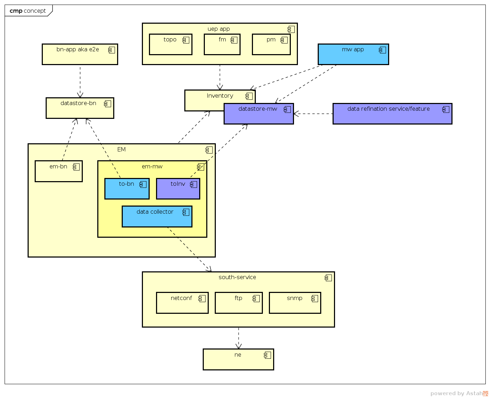
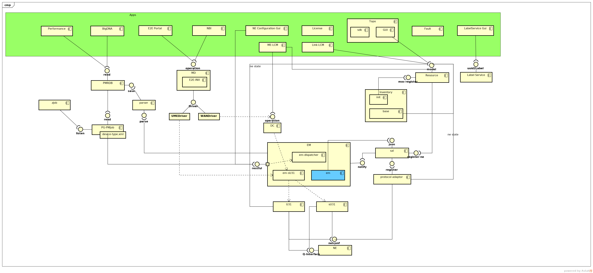

##### OVERVIEW
- Components Structure

- what is CPaaS?
    - <b>A PaaS custom by UEP based on Open PaaS</b>

- what is OTCP(OES TCP)?
    - component package provided by Wireless production 
    - provide common services such as PostgreSql, ZooKeeper, elastaticsearch and so on
    - provide basic components which used for NMS

- what is UME?
    - components or microservices provided by sub production line(e.g. BN, MW)
    
###### [road map](./roadmap.md)    

###### Using CPaaS with OTCP component package 

1. [wiki path](https://wiki.zte.com.cn/pages/viewpage.action?pageId=367729056)
2. [CPaaS package ver. 1.17.30.03.p10](https://artxa.zte.com.cn:443/artifactory/oes_tcp-release-generic/embpaas/both/v1.17.30.03.p10_1595805_1/version)
3. [CGSL iso](http://openpalette.zte.com.cn/docs/ver/v1.17.30.03.p10/installation_guide/images_release_notes.html)
4. [OTCP package ver.1.18.10.06.p01 ](https://artxa.zte.com.cn/artifactory/oes_tcp-release-generic/VERSION/v1.18.10.06.p01)

###### installation instruction

- [bare metal](./bare_scenario/README.md)
- [preset node](./preset_scenario/README.md)
- [install OTCP after install PaaS](./otcp/README.md)
- ps: UME release with OTCP since 2018Q1 

###### how to work with it
- [administration](http://ip/portaladmin/) admin/111111
- [project view](http://ip/portal/) project user or admin
- [msb view](http://ip/msb/)

###### develop framework
- [https://spring.io/guides/gs/rest-service/](https://spring.io/guides/gs/rest-service/)
- [https://www.dropwizard.io/1.3.2/docs/](https://www.dropwizard.io/1.3.2/docs/)

###### references
- [Richardson Maturity Model](https://martinfowler.com/articles/richardsonMaturityModel.html)

###### ume structure
 