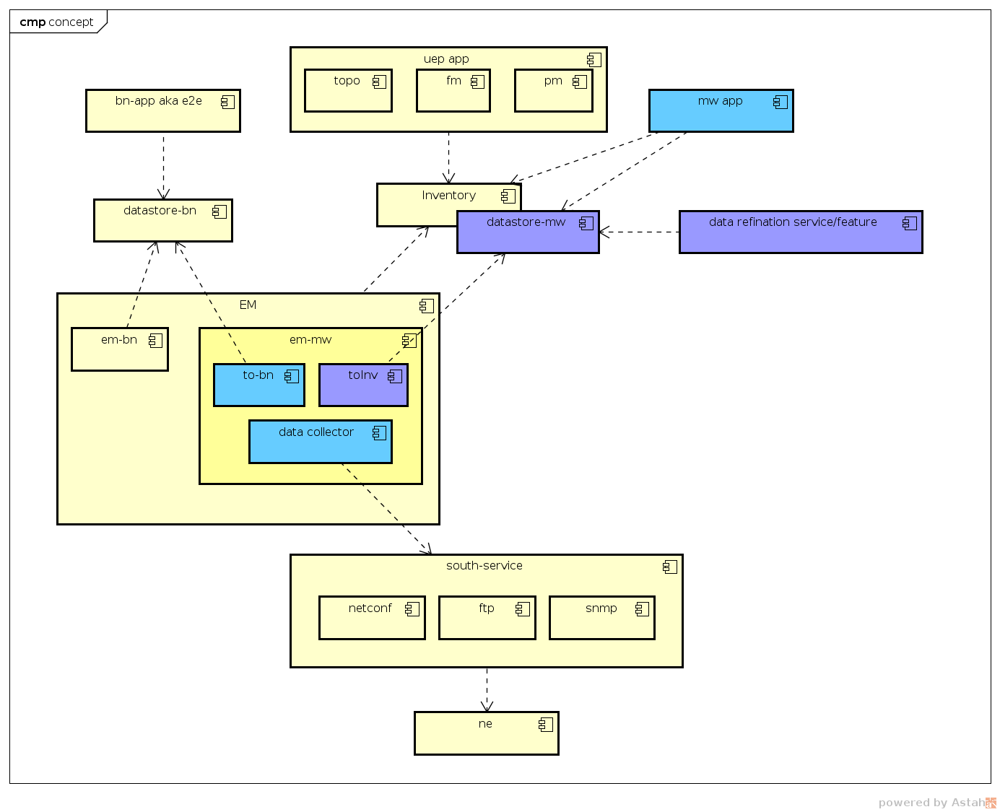

##### OVERVIEW
- Components Structure

- what is CPaaS?
    - <b>A PaaS custom by UEP based on Open PaaS</b>

- what is OTCP(OES TCP)?
    - component package provided by Wireless production 
    - provide common services such as PostgreSql, ZooKeeper, elastaticsearch and so on
    - provide basic components which used for NMS

- what is UME?
    - components or microservices provided by sub production line(e.g. BN, MW)
    
###### [Road map](./roadmap.md)    

###### Using CPaaS with OTCP component package 

1. [wiki path](https://wiki.zte.com.cn/pages/viewpage.action?pageId=367729056)
2. [CPaaS package ver. 1.17.30.03.p10](https://artxa.zte.com.cn:443/artifactory/oes_tcp-release-generic/embpaas/both/v1.17.30.03.p10_1595805_1/version)
3. [CGSL iso](http://openpalette.zte.com.cn/docs/ver/v1.17.30.03.p10/installation_guide/images_release_notes.html)
4. [OTCP package ver.1.18.10.06.p01 ](https://artxa.zte.com.cn/artifactory/oes_tcp-release-generic/VERSION/v1.18.10.06.p01)

###### installation instruction for whole system
- [How to deploy PaaS&OTCP&UME v2](deploying_documents/deploy_paas&otcp&ume_v2.md) 
- [How to deploy PaaS&OTCP&UME v1](deploying_documents/deploy_paas&otcp&ume_v1.md)
- [How to begin an project](deploying_documents/HelloWorld4PaaS.md)

###### component describe
- [bare metal](./bare_scenario/README.md)
- [preset node](./preset_scenario/README.md)
- [install OTCP after install PaaS](./otcp/README.md)
- ps: UME release with OTCP since 2018Q1 

###### how to work with it
- [administration http://10.86.110.251/portaladmin/](http://10.86.110.251/portaladmin/)  admin/111111
- [project view http://10.86.110.251/portal/](http://10.86.110.251/portal/)  project user(can be set in portaladmin)
- [msb view http://10.86.110.251/msb/](http://10.86.110.251/msb/)
- [ume https://10.86.110.251:28002/spt-portal-omc](https://10.86.110.251:28002/spt-portal-omc) admin/Zenap_123

###### issue encountered
- [scale up pods limit](issues/how_to_scale_up_pod_limits.md)
- [cannot login as admin to ume portal](issues/fix_ume_login.md)
- [create_image_failed](issues/create_image_failed.md)
- [deploy blueprint failed](issues/deploy_blueprint_failed.md)
- [initial component failed during the process of deploying paas after edit config file](issues/initial_component_failed_while_deploying_paas.md)
- [deploy UME success, but one of component failed-umebn_unified_servicecenter](issues/umebn_unified_servicecenter_component_failed.md)
- [create tenant failed during deploying the otcp with ume](issues/failed_to_create_tenant_deploying_otcp)
- [create volumn failed during deploying the otcp with ume](issues/failed_to_create_volumn_deploying_otcp.md)
- [cannot find commonservice during deploying the otcp wit ume](issues/cannot_find_commonservice_while_deploying_otcp.md)
- [cannot select the latest version of redis](issues/how_to_select_redis_version.md)

###### develop framework
- [https://spring.io/guides/gs/rest-service/](https://spring.io/guides/gs/rest-service/)
- [https://www.dropwizard.io/1.3.2/docs/](https://www.dropwizard.io/1.3.2/docs/)

###### references
- [Richardson Maturity Model](https://martinfowler.com/articles/richardsonMaturityModel.html)
