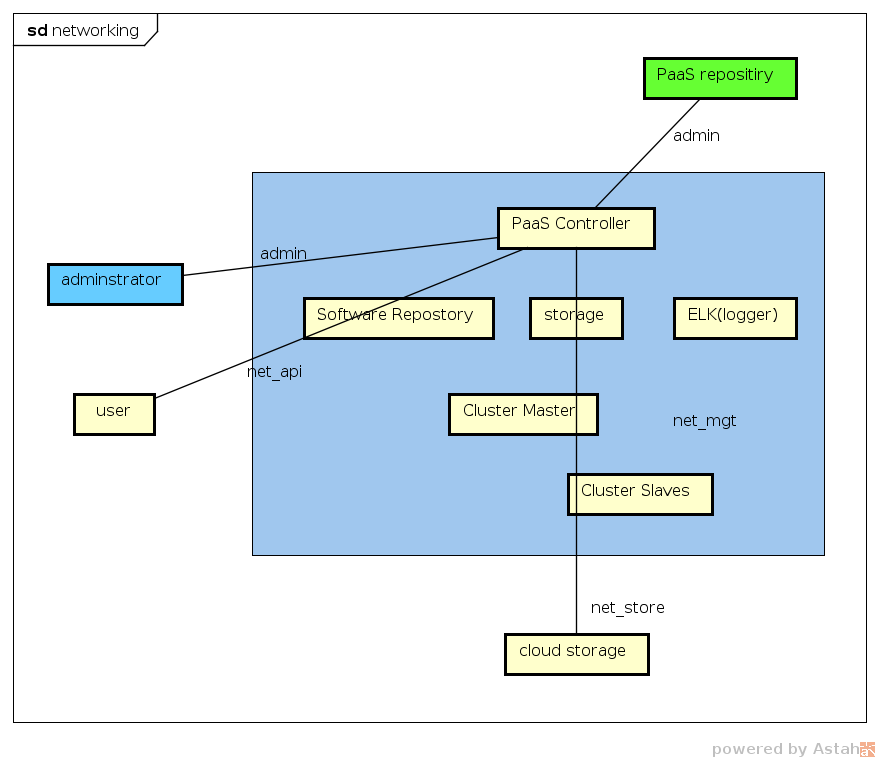
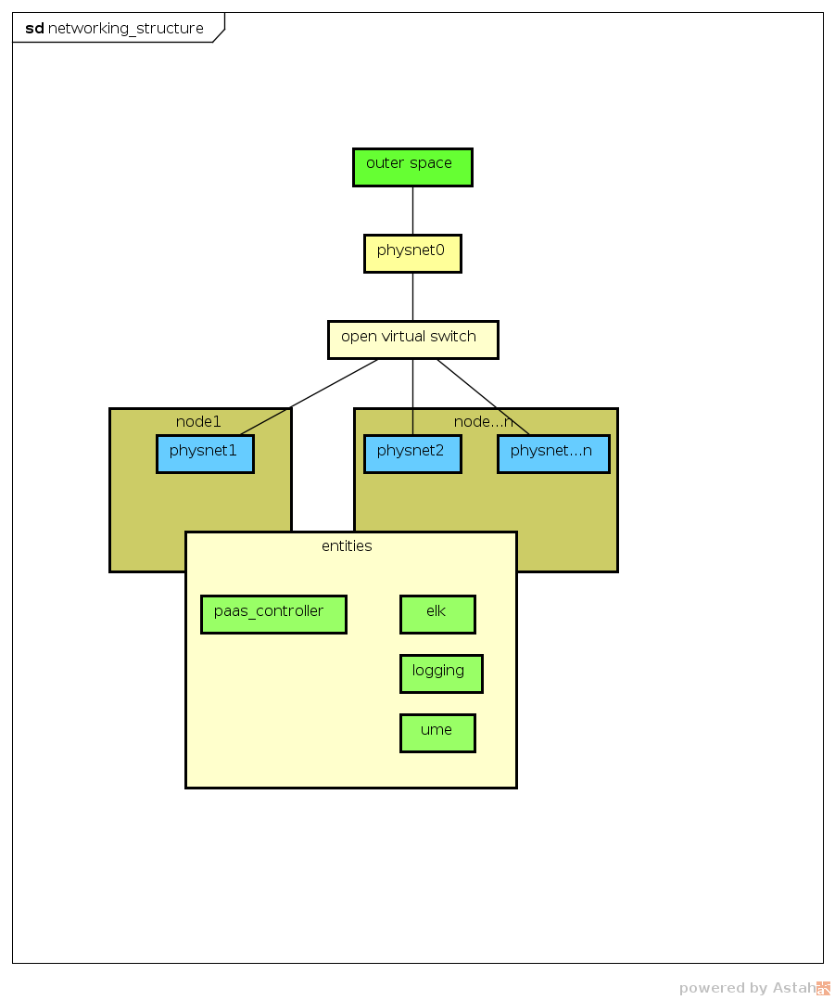
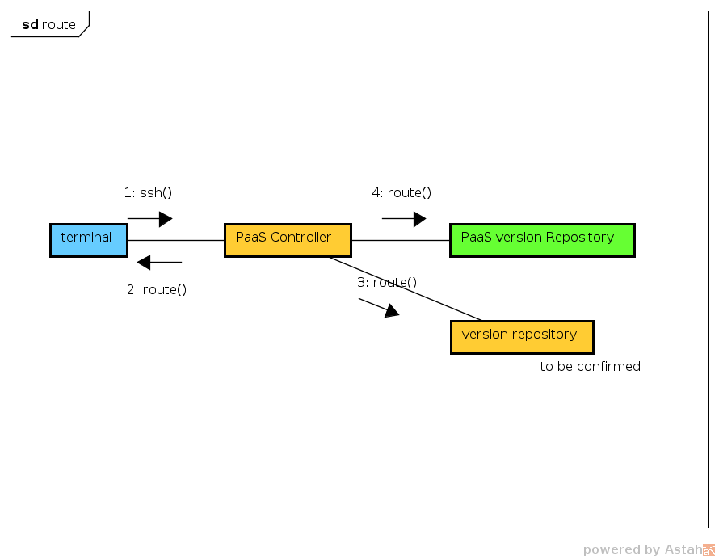

#### networking plan

##### prepare ip address (<b>FINISH IT IN LOCAL TERMINAL</b>) 
- 3 IPs at least
    1. temporary <b>PUBLIC</b> ip for version downloading 
    2. 2 continuous ip use as floating ip

- 2 network interface at least

    
    1. physnet0 : flat, public access
    2. physnet1 : vlan, internal switch(open virtual switch will override it), for internal exchange
    3. physnet...: vlan, just like physnet1

- ip address deployment <b>DO NOT USE 'ifcfg-' FILE</b>
    1. config temporary public ip
        ```
        ifconfig [PUBLIC CONNECTED INTERFACE] [TEMP IP] up
        ```
    2. config admin ip for network deployment
    
    ```
    ## create admin net using 88.88.1.* in any interface (don't know why)
    ## enp129s0f0 connect to where and why 88.88.1.*?
    ifconfig enp129s0f0 88.88.1.2/24 up
    ```

- create static route for admin connections (ps: current route would be reset during setup process) (<b>version repository deployed locally</b>)
 
    ```
    ## admin connection from terminal to controller
    route add -net [xxx.xxx.xxx.xxx/xx] gw [local gateway]

    ## admin connection to PaaS repository
    ## 10.67.18.8 is the address of PaaS repository
    route add -net 10.67.18.0/24 gw [local gateway]
    ```
- network realms
    1. net_api : physnet1 or physnet2
    2. net_mgt : physnet1 or physnet2
    3. net_iapi : physnet0  
    4. net_ctrl : physnet1 or physnet2
    5. net_media : physnet1 or physnet2 
    6. summary:
        - count(interfaces with connection) = count(physnet)
        - physnet0 with public ip
        - physnet1 or physnet2 and so on with no private ip

##### install pdm-cli & CPaaS offline 

- download and install pdm-cli [CPaaS package ver. 1.17.30.03.p10](https://artxa.zte.com.cn:443/artifactory/oes_tcp-release-generic/embpaas/both/v1.17.30.03.p10_1595805_1/version) 
```
## after download the packages
## enter dowload folder
## 33 files in total

cd [upload directory]
mkdir -p /paasdata/offline/paas
mv paas* /paasdata/offline/paas
cd /paasdata/offline/paas
cat paas*.tar.gz* | tar -xzf - && cd pdm-cli && ./install.sh

```

##### configure parameters for PaaS
- steps:
 1. understand 'net_api', 'net_mgt', 'net_admin' and 'net_store'(see also pic.1)
 2. modify [/etc/pdm/conf/vnm_network.conf](./etc/pdm/conf/vnm_network.conf) explains in [vnm_network.conf.md](./etc/pdm/conf/vnm_network.conf.md)
 3. modify [/etc/pdm/conf/conf.json](./etc/pdm/conf/conf.json) explains in [conf.json.md](./etc/pdm/conf/conf.json.md)  according to <b>chapter - 4.2</b> in [http://openpalette.zte.com.cn/docs/ver/v1.17.30.03.p10/installation_guide/paasInstall/n_merged_into_one_new.html#id10](http://openpalette.zte.com.cn/docs/ver/v1.17.30.03.p10/installation_guide/paasInstall/n_merged_into_one_new.html#id10)
 4. modify [/etc/network/Inet_deploy.conf.tmpl](./etc/network/Inet_deploy.conf.tmpl) explains in [Inet_deploy.conf.tmpl.md](./etc/network/Inet_deploy.conf.tmpl.md) (using only one network interface)
 5. modify [/etc/pdm/OCSA_VM.conf](./etc/pdm/OCSA_VM.conf)
 6. deploy offline
    ```
    pdm-cli deploy --offline
    ```
#### verify deploy 
```
   http://[ip]/portal/#/login
```
   
