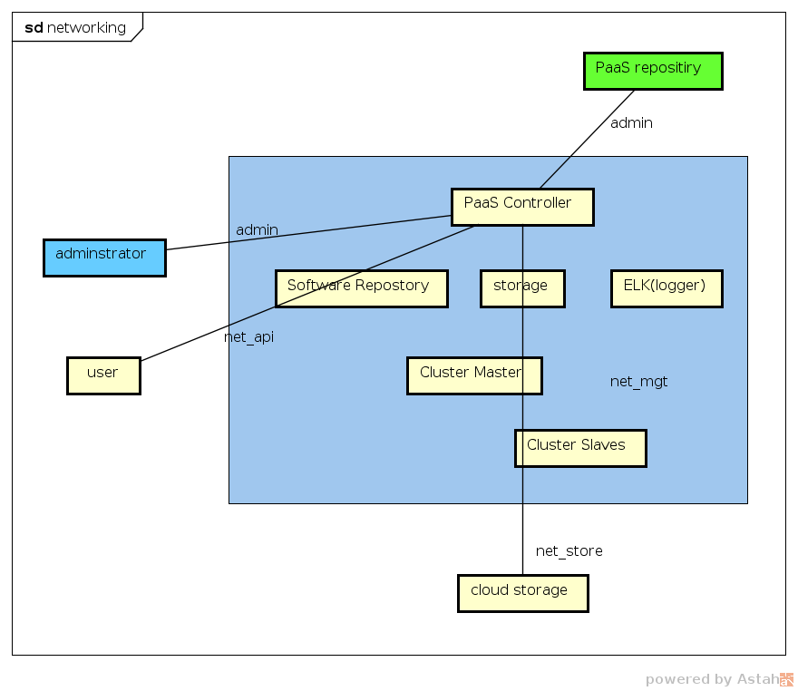
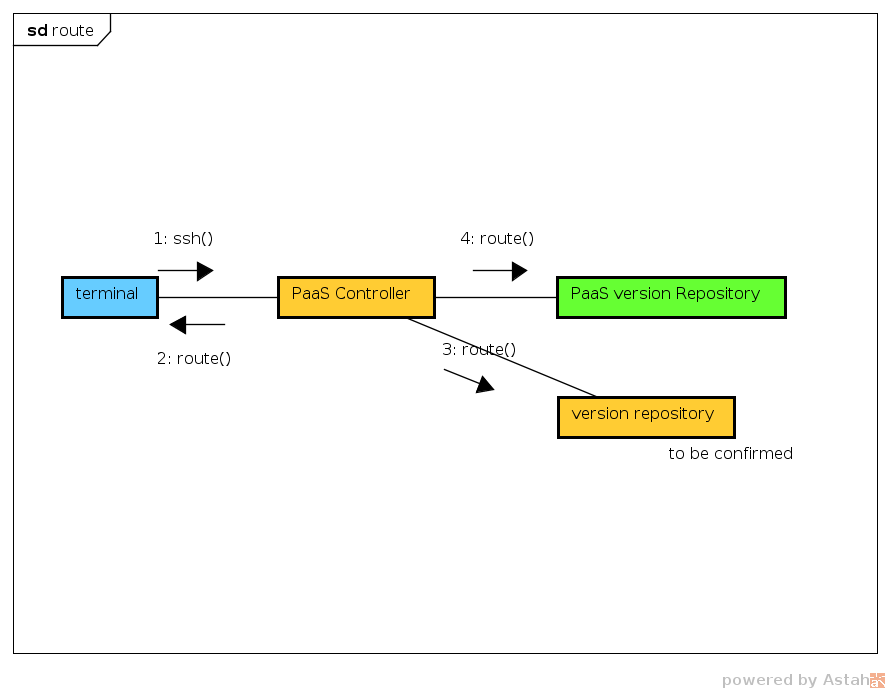

#### networking plan

##### preparation
- create static route for admin connections (ps: i donot know why) (<b>version repository deployed locally</b>)
 
```
## 10.67.18.8 is the address of PaaS repository
## admin connection for administrator
route add -net [ip section of terminal].0/24 gw [local gateway]
## admin connection to PaaS repository
route add -net 10.67.18.0/24 gw [local gateway]
```
##### install pdm-cli & CPaaS offline 

- download and install pdm-cli [CPaaS package ver. 1.17.30.03.p10](https://artxa.zte.com.cn:443/artifactory/oes_tcp-release-generic/embpaas/both/v1.17.30.03.p10_1595805_1/version) 
```
## after download the packages
## enter dowload folder
## 33 files in total
mkdir -p /paasdata/offline/paas
mv paas* /paasdata/offline/paas
cd /paasdata/offline/paas
cat paas*.tar.gz* | tar -xzf - && cd pdm-cli && ./install.sh
```

##### configure parameters for PaaS
- questions: 
  - what are phynet1 and phynet2 for?
  - How to deploy ZICT PaaS with only one network interface?
- steps:
 1. understand 'net_api', 'net_mgt', 'net_admin' and 'net_store'(see also pic.1)
 2. modify [/etc/pdm/conf/vnm_network.conf](./vnm_network.conf)
     ```
    # origin from UEP : network_vlan_ranges = physnet0:100:200,physnet1:100:200,physnet2:100:200
    # still don't know what does vlan for and Can I ignore it? 
    # according to /etc/network/Inet_deploy.conf.tmpl, 3 phynet assigned to same interface, so still follow uep for now 
    network_vlan_ranges = physnet0:100:200,physnet1:100:200,physnet2:100:200
     ``` 
 3. modify [/etc/pdm/conf/conf.json](./conf.json) according to <b>chapter - 4.2</b> in [http://openpalette.zte.com.cn/docs/ver/v1.17.30.03.p10/installation_guide/paasInstall/n_merged_into_one_new.html#id10](http://openpalette.zte.com.cn/docs/ver/v1.17.30.03.p10/installation_guide/paasInstall/n_merged_into_one_new.html#id10)
 ```
 ## set network type to 'flat' means segmentation_id can be null
 "provider:network_type": "flat",
 "provider:physical_network": "physnet0",
 "provider:segmentation_id": ""
 ```
 4. modify [/etc/network/Inet_deploy.conf.tmpl](./Inet_deploy.conf.tmpl) (using only one network interface)
 5. modify [/etc/pdm/OCSA_VM.conf](./OCSA_VM.conf)

#### deploy PaaS online
```
pdm-cli deploy
```

#### deploy PaaS offline
1. download package [https://artnj.zte.com.cn/artifactory/webapp/#/artifacts/browse/tree/Builds/zxnp_pict-snapshot-generic/official_latest_pkg/](https://artnj.zte.com.cn/artifactory/webapp/#/artifacts/browse/tree/Builds/zxnp_pict-snapshot-generic/official_latest_pkg/)
```
## login with given username and password first and then click the link
username: zxnp_pict-ci
password: zxnp_pict-ci_123456
```
```
## after download the packages
## enter dowload folder
mkdir -p /paasdata/offline/paas
mv PICT* /paasdata/offline/paas
cd /paasdata/offline/paas
cat PICT*.tar.gz* | tar -xzf - && cd pdm-cli && ./install.sh
```
2. upload all configuration files
```
/etc/pdm/conf/vnm_network.conf
/etc/pdm/conf/conf.json
/etc/pdm/OCSA_VM.conf
/etc/network/Inet_deploy.conf.tmpl
```
3. deploy offline
```
pdm-cli deploy --offline
```
4. import public services, [where and what are the public services?](https://artnj.zte.com.cn/artifactory/webapp/#/artifacts/browse/tree/General/zxnp_pict-snapshot-generic/official_latest_pkg/v1.17.30.03.p10/commsrv/)
```
mkdir -p /paasdata/offline/commsrv
mv [public service packages] /paasdata/offline/commsrv
## has not tried it myself, maybe mkdir -p /root/zartcli/zartcli first?
cat PICT*.tar.gz* | tar -xzf - /root/zartcli/zartcli -o import -i admin -p /paasdata/offline/commsrv/download
```
5. import programming framework [framework packages](https://artnj.zte.com.cn/artifactory/webapp/#/artifacts/browse/tree/General/zxnp_pict-snapshot-generic/official_latest_pkg/v1.17.30.03.p10/framework)
```
mkdir -p /passdata/offline/framework
mv [framework packages] /passdata/offline/framework
cat PICT*.tar.gz* | tar -xzf - /root/zartcli/zartcli -o import -i admin -p /paasdata/offline/framework/download
```

#### verify deploy 

   
