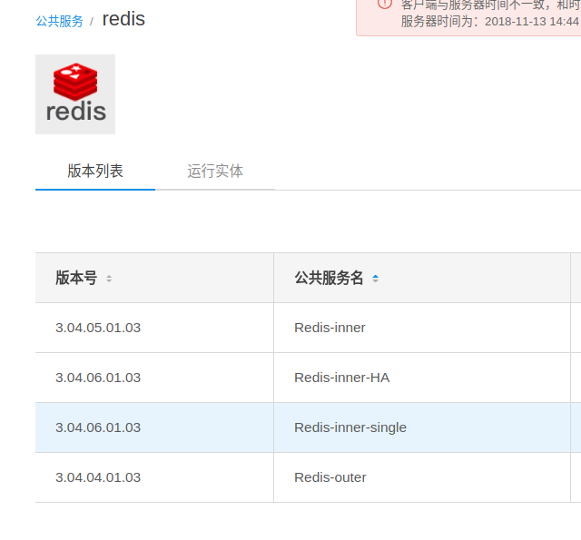

-   问题描述  
    这个问题是从无法登录portal而来的，解决方案是更换otcp版本以更换redis版本。
-   解决方案  
    1.  更换otcp为使redis的版本满足3.04.06.01.03，然而安装后发现有多个redis的公共镜像，版本各不相同。  
      
    2.  但是可以看到运行实体的redis为3.04.05.01.03版本，这样还是没有办法使用3.04.06.01.03版本的redis  
    3.  在oki-tools新的版本中(v1.18.30.06.p03)中有配置文件oki-tools/config/install-commonservice.conf，修改其redis-choose中的default为“commsrv_inner_redis_single_bp”
    4.  但发现这样部署会出现\[zenap_redis\]这个组件无法正常部署，因为redis的实例需要密码而没有配置，默认密码是db10$ZTE
    5.  使用工具加密，执行```./oki-cli encrypt db10\$ZTE```得到加密后的密码
        > 注:输入密码的$,|,\三个符号需要转意
    6.  修改配置
        ```
        vi /home/ubuntu/paasdata/oki-tools/config/commonservice-instance-config.xml
        vi /home/ubuntu/paasdata/otcp/OES_Framework_GREF_SM/commonservice-instance-config.xml
        ```
        修改配置文件中
        ```
        <instance name="zenap_redis">为<instance name="zenap_redis" password="JhEIICmq97Xv1RvXUvbeRg==">
        ```
        注意这里有个orch_name，和选择的不一样，但无需修改。