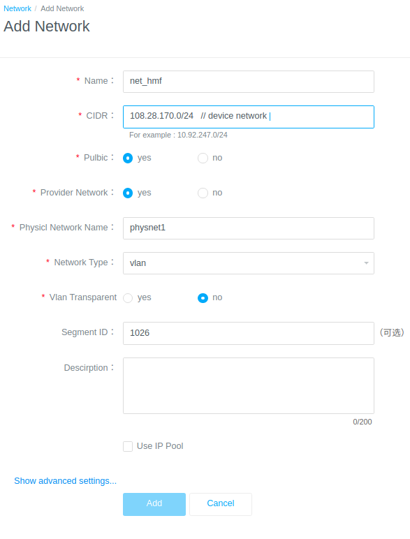

### download package
### unzip 
### execute install command
- deploy net_hmf(for legacy ems) and net_ne(for ne)
    1. using already deployed physnet
        - plug fiber to inner connection interface(etc. physnet1/enp2s0f1)
        - create it on site  http://ipaddr/portaladmin/#/main/resourcemanager/sharednetwork/list
        
    2. using extra physical network
        1. 改vnm的相关配置，文件在paascontroller上/etc/vnm/目录下
            1. ml2_conf.ini 
                ```
                修改network_vlan_ranges = physnet0:101:1000,physnet1:101:1000，增加需要的physnet
                network_vlan_ranges = physnet0:101:1000,physnet1:101:1000,physnet2:101:1000
                ```
            2. ovs_neutron_plugin.ini 
                ```
                修改bridge_mappings = physnet0:br-phy0,physnet1:br-phy1，增加需要的physnet
                bridge_mappings = physnet0:br-phy0,physnet1:br-phy1,physnet2:br-phy2
                ```
         
        2. 基础设施网络配置文件/etc/network/Inet_deploy.conf
            - 如果增加的是走sriov的
                1. provider值里增加一个sriov，比如provider=ovs 改为 provider=ovs,sriov
                2. 增加段<b>[sriov]</b>，并在该段下增加physnet信息，比如
                    ```
                    [sriov]                         #sriov配置，对应paasnw_drivers.conf文件的sriov_nic段
                    devicemapping=physnet3:ens1f0   #对应paasnw_drivers.conf文件的sriov_nic段physical_device_mappings值
                    defaultmaxvfs=63                #对应paasnw_drivers.conf文件的sriov_nic段physical_defaultmaxvfs值
                    devicemaxvfs=ens1f0:63          #对应paasnw_drivers.conf文件的sriov_nic段physical_maxvfs值
                    ```
            - 如果增加的是走physical的
                1. provider值里增加一个physical，比如provider=ovs 改为 provider=ovs,physical
                2. 增加段[physical]，并在该段下增加physnet信息，比如
                    ```
                    [physical]
                    physical_pf_mappings=physnet3:ens1f0                        #对应paasnw_drivers.conf文件的physical段physical_pf_mappings值
                    ```
        <b>注意，接下来的3和4两步会导致浮动ip断，请在kvm或者小网上操作</b>
        
        3. 执行基础设施网络脚本/etc/network/vNM_Inet_deploy.sh
        4. 重启vnm服务 docker restart vnm
        5. 增加的sriov或者physical配置，实际上是为了给本节点上的NW模块使用的，生成更新后的配置文件在/etc/network/paasnw_drivers.conf
            ```
              【如果本节点角色含有minion，则NW在部署的时候会自动复制/etc/network/paasnw_drivers.conf放到/etc/paasnw/paasnw_drivers.conf 】
            现在节点是minion角色的话，需要手动复制cp /etc/network/paasnw_drivers.conf  /etc/paasnw/
            然后重启nw的某些服务才能生效，这个具体事宜请咨询李钊。
            ```

- install all in one click

```
cd [unzip_path]/otcp-v[version]/oki-tools/tools/bin
chmod a+x oki-cli
# disable gbase
./oki-cli component set --gbase=false

./oki-cli install -m all -t otcp
```
- install step by step
```
./oki-cli component set --gbase=false
./oki-cli install -m steps -t otcp

```
