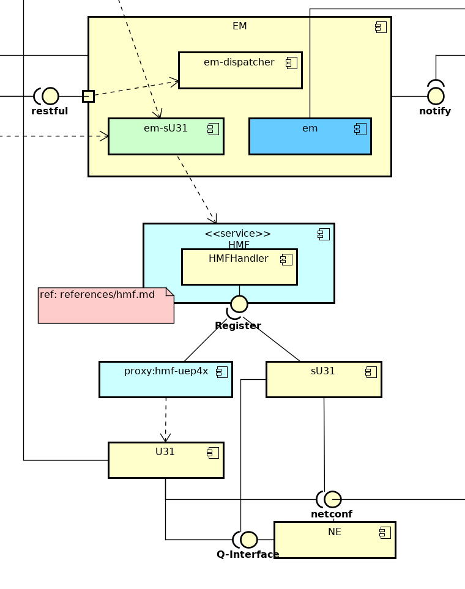
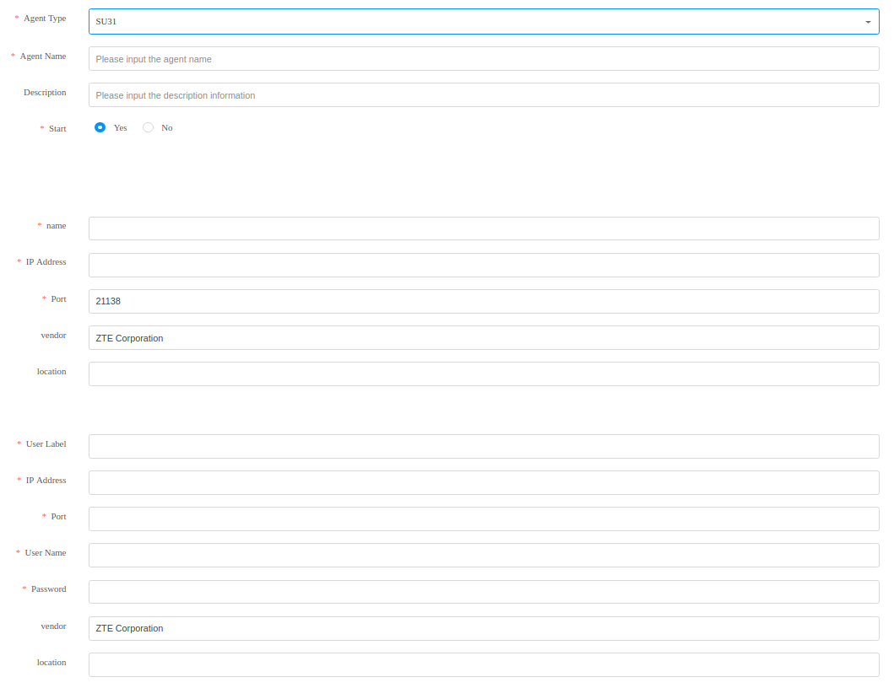

###### OVERVIEW

- HMF stands for Hierarchy Management Framework, which provides proxies for sub-level NMS(e.g. EMS, SDN Controller, sU31...)
- Every sub-level NMS needs One HMF Main Adaptor to be represented by.
- hmf-uep4x as one HMF Main Adaptor which represents EMS and sU31
- UME-BN considers sU31 as agent of EMS 

###### enable hmf on EMS as lower level
- reveal configurations of HMF
```
    nano ~/uif/conf/commoncustomize-uep.xml
```
- search configCenterPlugin_hidden_nodes.HierarchyConfig
```xml
<node id="HierarchyConfig" >
    <process   name="TOOL" hidden="false"> </process>
    <process   name="STEPPLUGIN"  hidden="false" rewritable="false"> </process>
</node>
```
- change both <b>true</b> to <b>false</b>
- start runPluginCenter
```
~/uif/runPlugCenter.sh
```
- change configurations of HMF


###### add U31 as SU31 to UME
```
https://X.X.X.X:28002/spt-portal-omc/framework/default.html
Topo---Hierarchical Access --- NEW --- sU31

ps: DC configurations can be ignorable...for now
```
