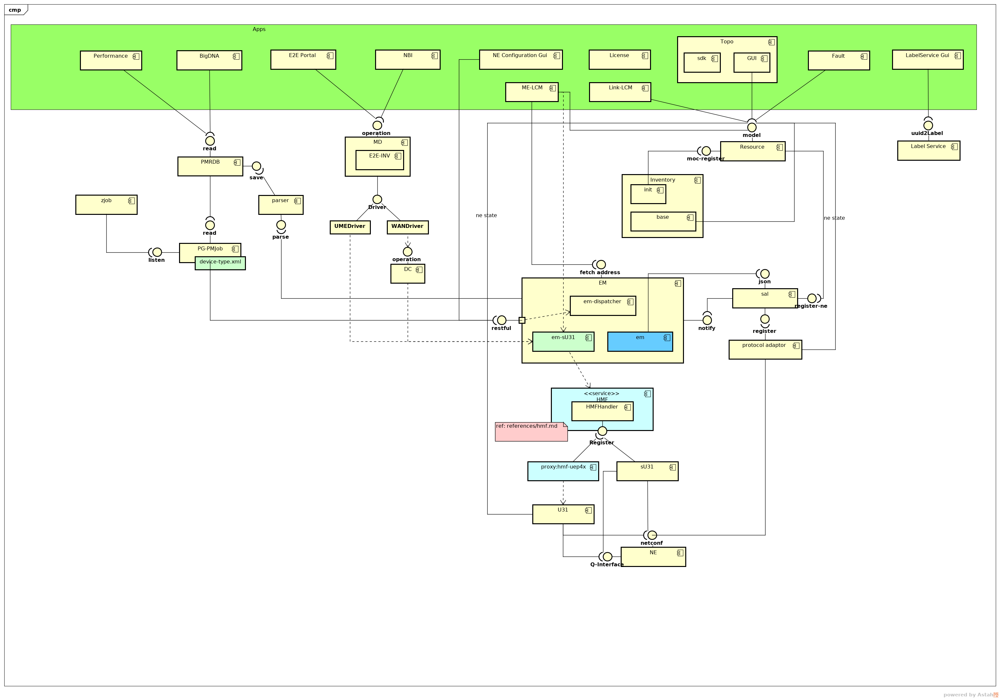
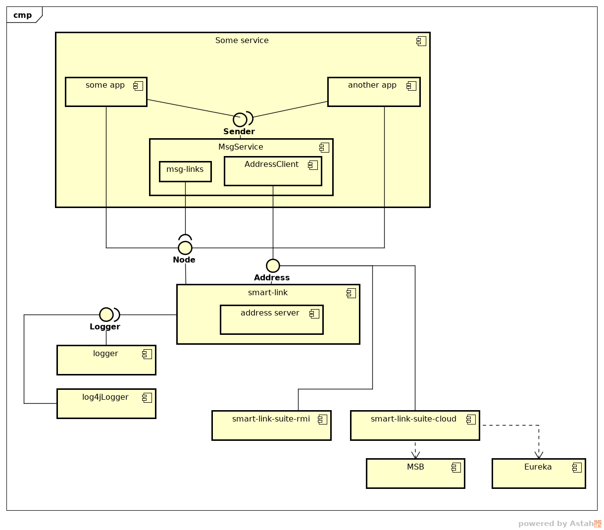
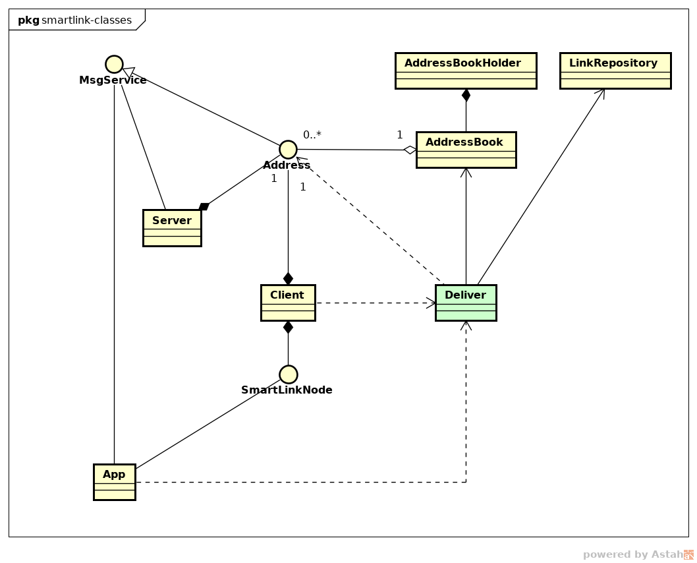
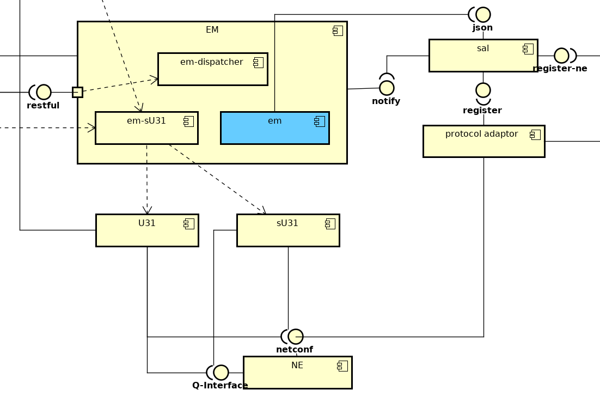

#### Road Map

###### overview

0. structure

0. code
    0. projects
        - smart link *communication component which can be associate with multiple implementations*
            - low level structure
            
            - class view
            
            - restful address
            - rmi address 
        - 
    0. UT
        - rules : 
    0. FT
        - rules : 
    0. CI

###### infrastructure 
0. smart link based communication architecture

###### ME-LCM

0. sU31-EM
 - inherit from BN
 - register device series and device types of Microwave
 
  
0. south oriented service

###### Link-LCM

0. Radio Model
0. life cycle of links
    - radio link
    - eth link
    - link levels
        - level 0
        - level 1
        - level 2
        - service or path

###### Performance Function Set
- todo

###### Fault Management Function Set
- todo

###### Inspection Applications
- todo

###### Applications provided by OTCP
- todo 

###### Applications provided by UME
- todo